# Cat.

#### How to contribute:
1. Create a copy of `cat_sitting_template.png` or `cat_standing_template.png`.
2. Open the file in *Microsoft Paint*.
3. Edit the image, following these guidelines:
   - Only use the `Brush` tool
   - Use **Black** (`#000000`)
   - Only draw within the facial region
   - Avoid exceeding the outline of the template
   - A mouse or touchpad is recommended
4. Rename the file to `cat_sitting_XXXXXXXX.png` or `cat_standing_XXXXXXXX.png`, replacing `XXXXXXXX` with something that describes what you have drawn and place it in the appropriate folder.
5. Raise a pull request with your newly drawn sitting/standing cat(s).
   - Sitting cats should be added to the `cats/` folder
   - Standing cats should be added to the `cats_2/` folder

#### Cat gallery.
___
#### Sitting Cat gallery.

<a href="cats/cat_sitting_10.png" title="10">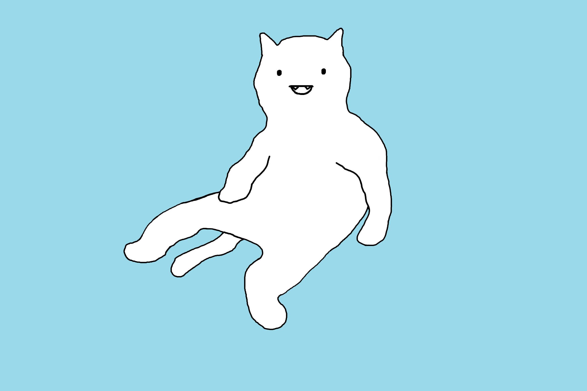 10</a><a href="cats/cat_sitting_2.png" title="2"> 2</a><a href="cats/cat_sitting_2024NewYear.png" title="2024NewYear"> 2024NewYear</a>

<a href="cats/cat_sitting_3.png" title="3"> 3</a><a href="cats/cat_sitting_4.png" title="4"> 4</a><a href="cats/cat_sitting_5.png" title="5"> 5</a>

<a href="cats/cat_sitting_6.png" title="6"> 6</a><a href="cats/cat_sitting_7.png" title="7"> 7</a><a href="cats/cat_sitting_8.png" title="8"> 8</a>

<a href="cats/cat_sitting_9.png" title="9"> 9</a><a href="cats/cat_sitting_O_O.png" title="O_O"> O_O</a><a href="cats/cat_sitting_^_^.png" title="^_^">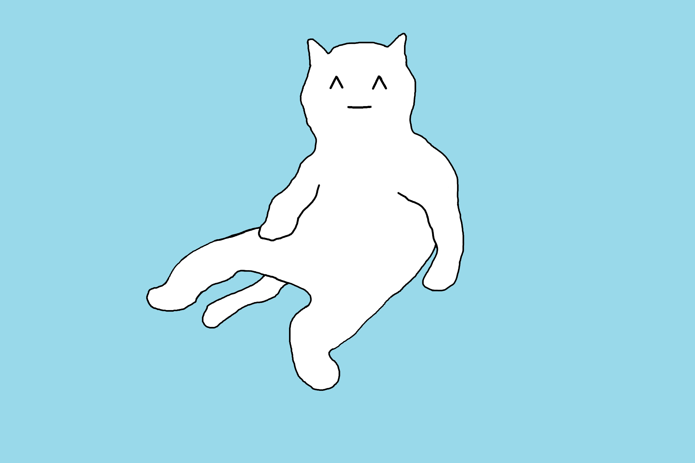 ^_^</a>

<a href="cats/cat_sitting_aang.png" title="aang"> aang</a><a href="cats/cat_sitting_angry.png" title="angry">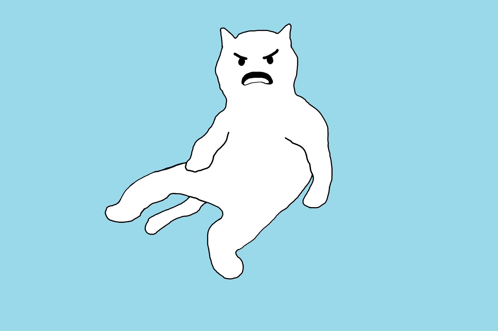 angry</a><a href="cats/cat_sitting_battlecat.png" title="battlecat">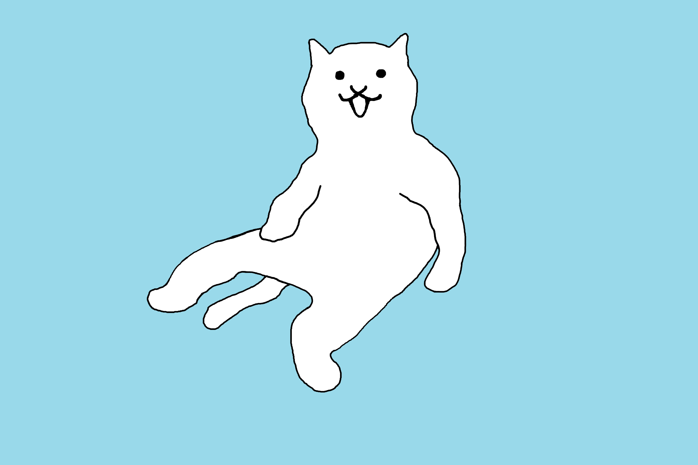 battlecat</a>

<a href="cats/cat_sitting_bulbasaur.png" title="bulbasaur"> bulbasaur</a><a href="cats/cat_sitting_chiyo-chichi.png" title="chiyo-chichi">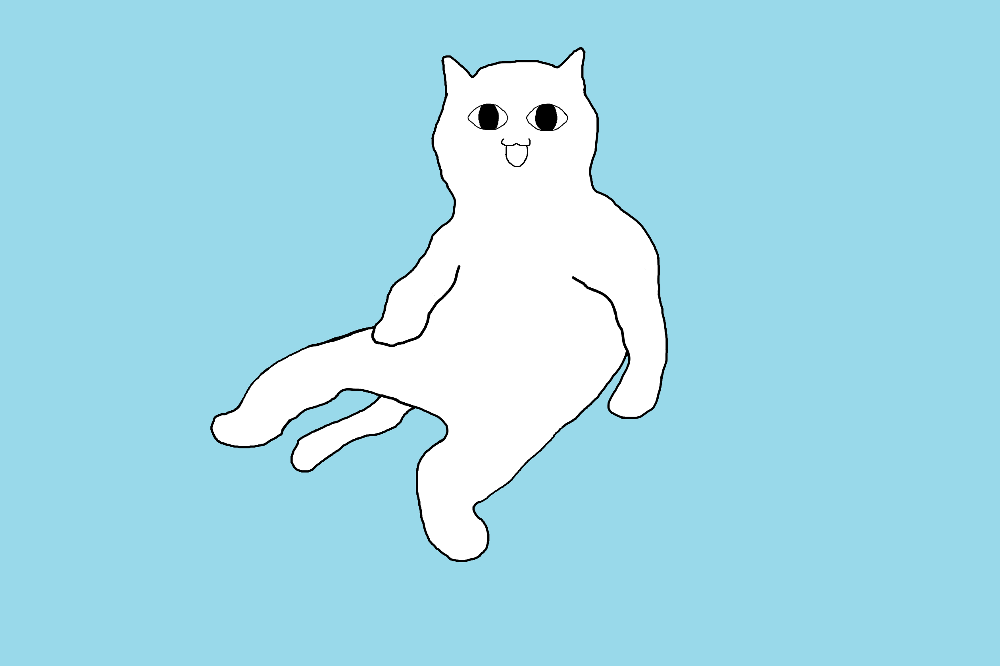 chiyo-chichi</a><a href="cats/cat_sitting_dino_ranger.png" title="dino_ranger"> dino_ranger</a>

<a href="cats/cat_sitting_ditto1.png" title="ditto1"> ditto1</a><a href="cats/cat_sitting_doraemon.png" title="doraemon"> doraemon</a><a href="cats/cat_sitting_gojo.png" title="gojo"> gojo</a>

<a href="cats/cat_sitting_harry_potter.png" title="harry_potter"> harry_potter</a><a href="cats/cat_sitting_hole.png" title="hole">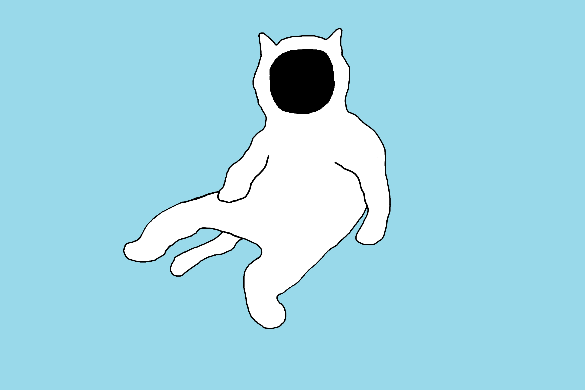 hole</a><a href="cats/cat_sitting_kamineko.png" title="kamineko"> kamineko</a>

<a href="cats/cat_sitting_man_face.png" title="man_face"> man_face</a><a href="cats/cat_sitting_mario.png" title="mario"> mario</a><a href="cats/cat_sitting_mimikyu.png" title="mimikyu"> mimikyu</a>

<a href="cats/cat_sitting_notvampire.png" title="notvampire">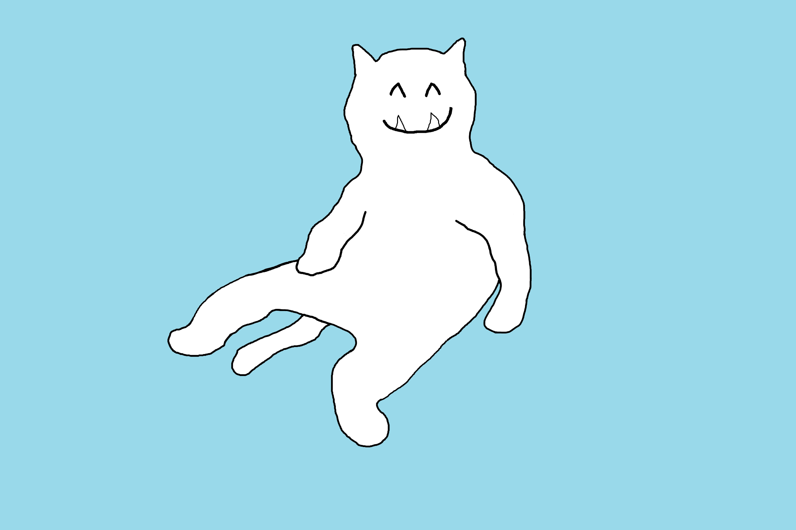 notvampire</a><a href="cats/cat_sitting_oof.png" title="oof">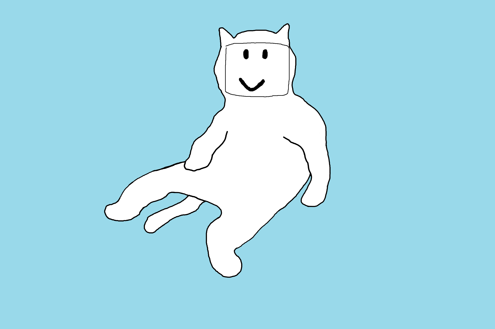 oof</a><a href="cats/cat_sitting_patrick.png" title="patrick"> patrick</a>

<a href="cats/cat_sitting_pepe.png" title="pepe"> pepe</a><a href="cats/cat_sitting_round_glasses.png" title="round_glasses"> round_glasses</a><a href="cats/cat_sitting_sad.png" title="sad">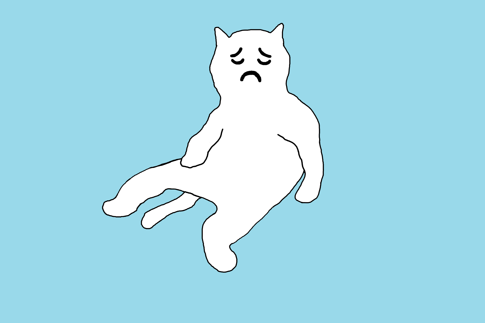 sad</a>

<a href="cats/cat_sitting_sharingan.png" title="sharingan"> sharingan</a><a href="cats/cat_sitting_sick.png" title="sick">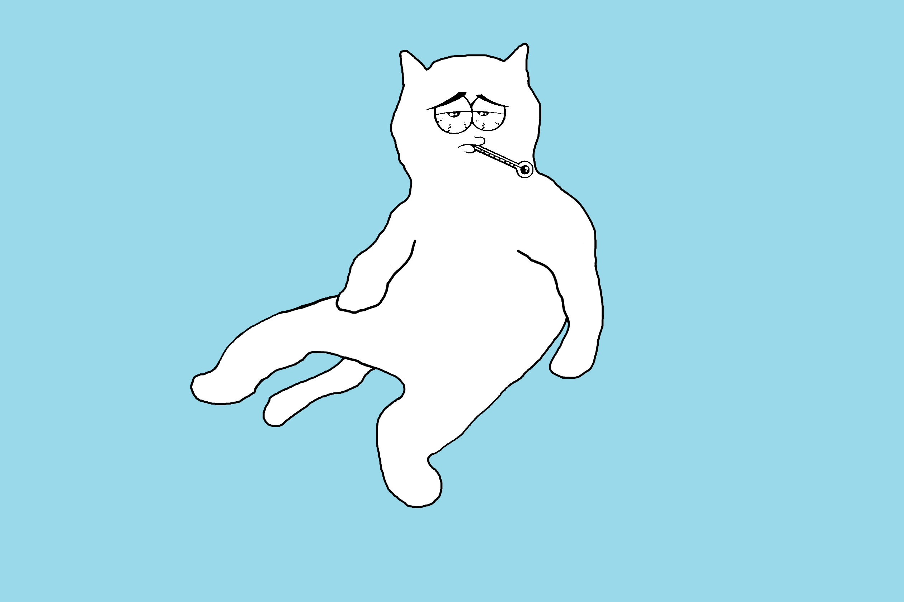 sick</a><a href="cats/cat_sitting_sideeye.png" title="sideeye"> sideeye</a>

<a href="cats/cat_sitting_skull.png" title="skull">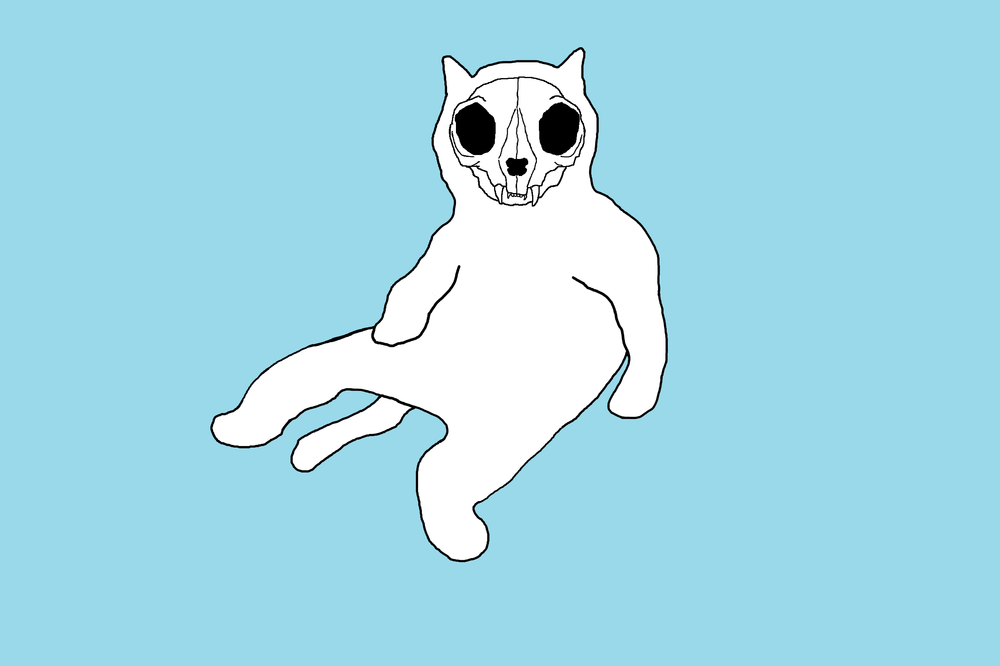 skull</a><a href="cats/cat_sitting_smug.png" title="smug"> smug</a><a href="cats/cat_sitting_squidward.png" title="squidward"> squidward</a>

<a href="cats/cat_sitting_tobi.png" title="tobi"> tobi</a><a href="cats/cat_sitting_tobi_mask.png" title="tobi_mask"> tobi_mask</a><a href="cats/cat_sitting_uwu.png" title="uwu"> uwu</a>

___
#### Standing Cat gallery.

<a href="cats_2/cat_standing_2.png" title="2">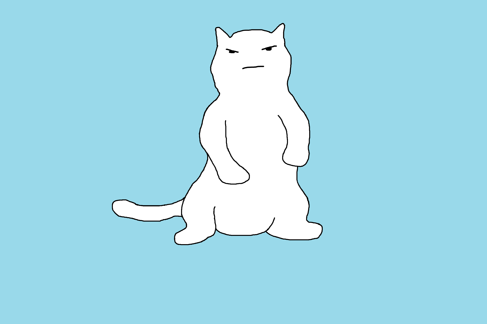 2</a><a href="cats_2/cat_standing_3.png" title="3">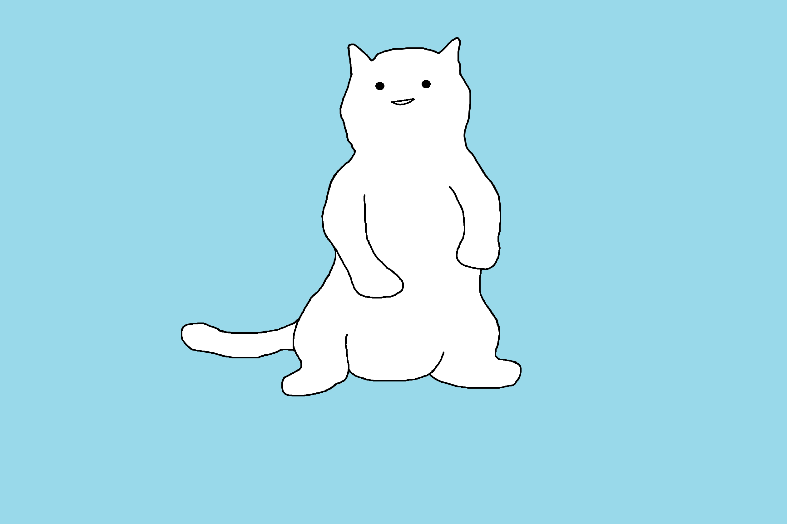 3</a><a href="cats_2/cat_standing_ditto1.png" title="ditto1">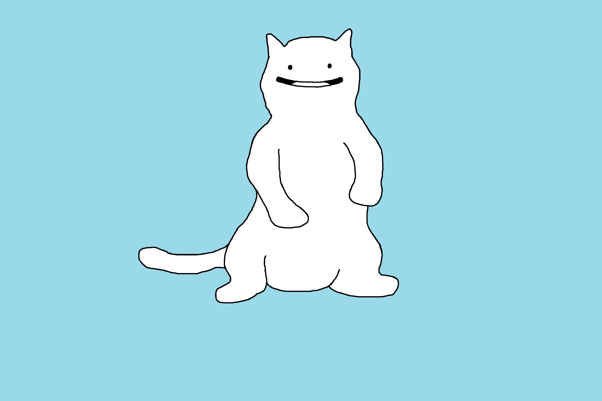 ditto1</a>

<a href="cats_2/cat_standing_mario.png" title="mario"> mario</a>

