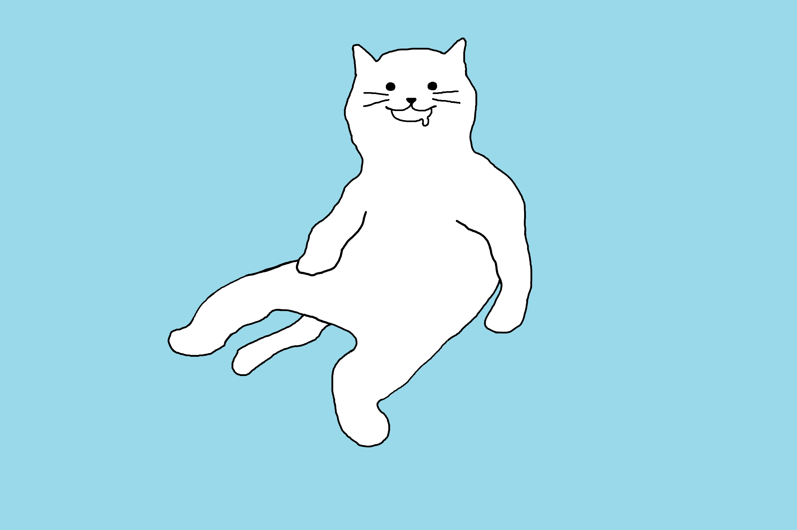
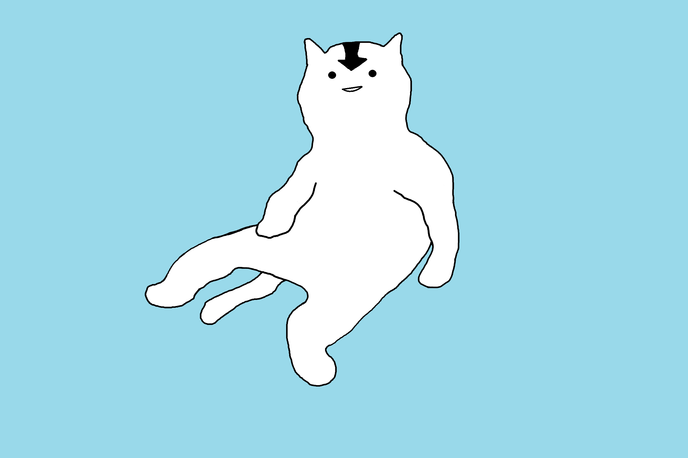
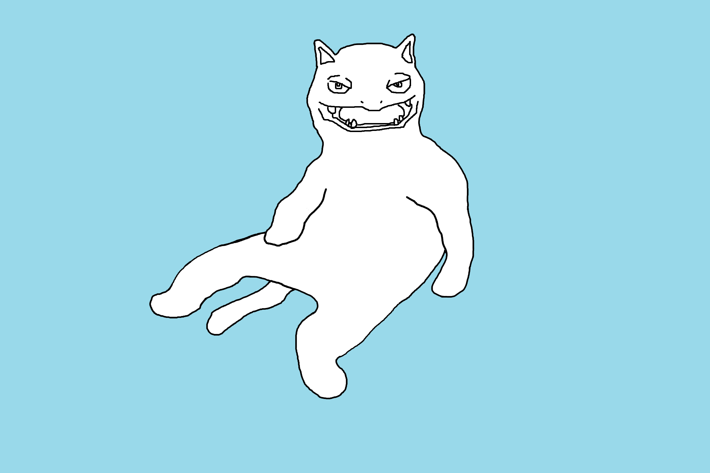
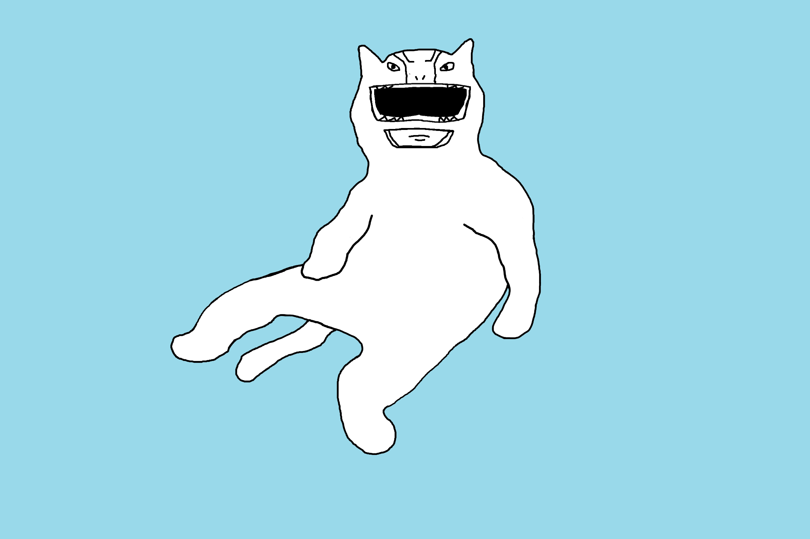
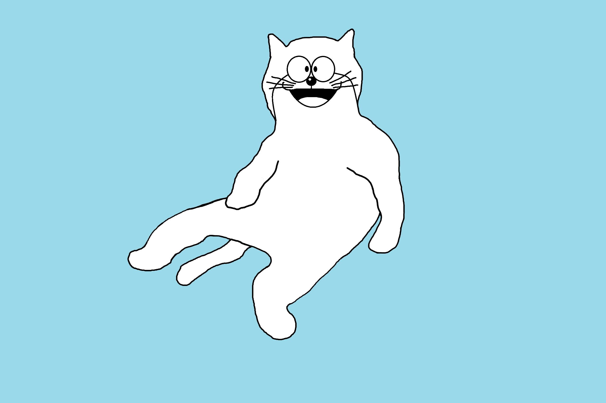
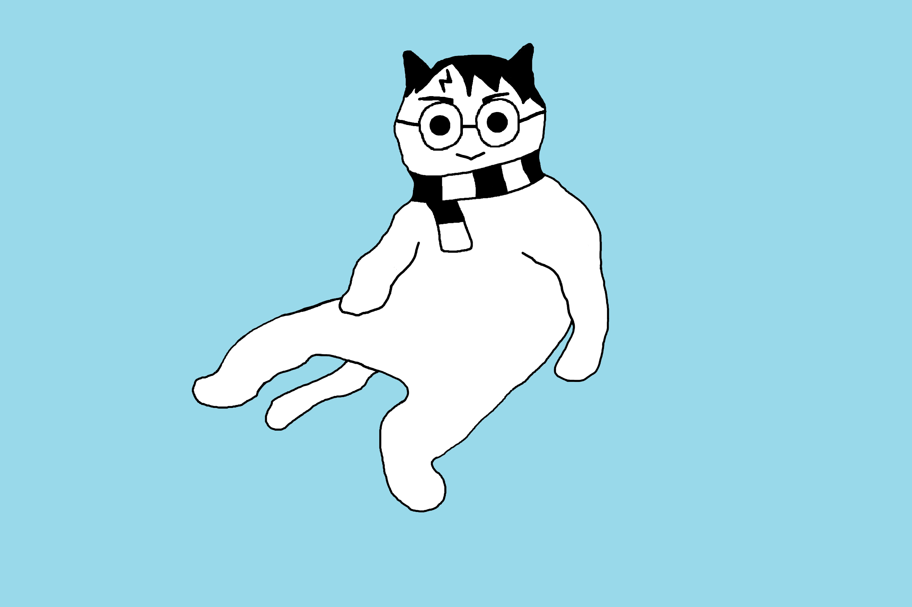
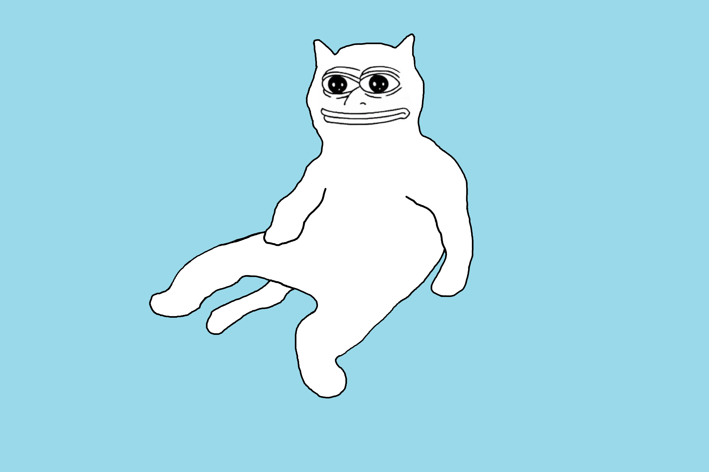
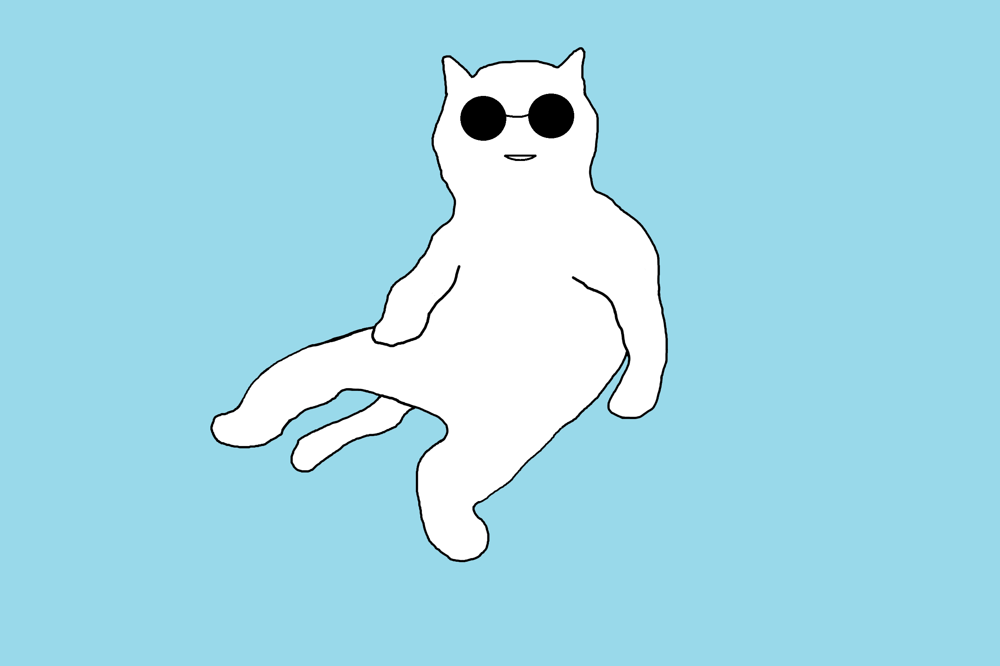
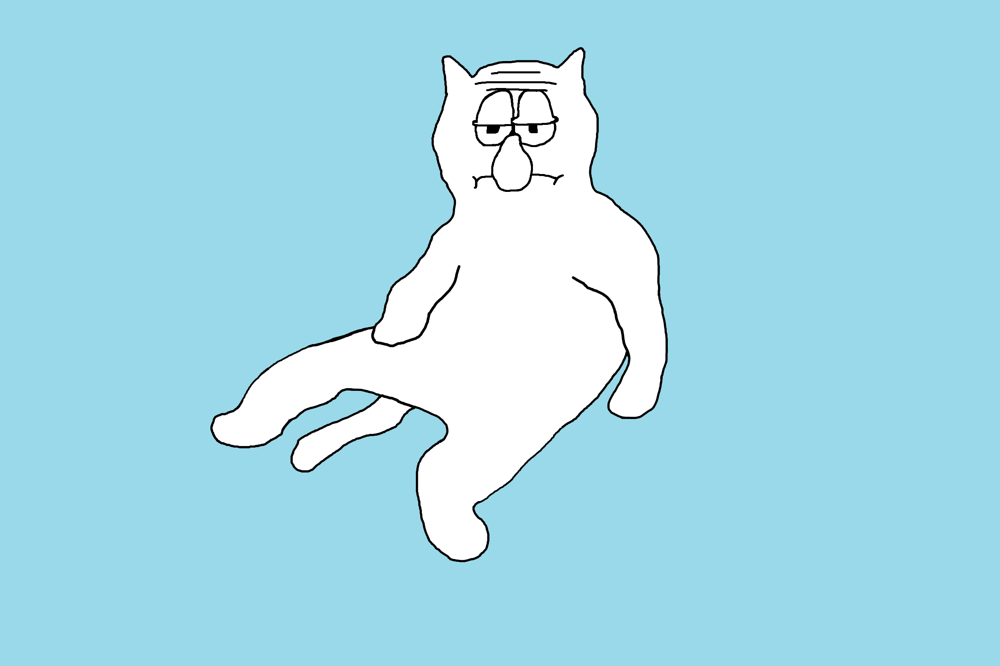

# Cat.

#### How to contribute:
1. Create a copy of `cat_sitting_template.png`.
2. Open the file in *Microsoft Paint*.
3. Edit the image, following these guidelines:
   - Only use the `Brush` tool
   - Use **Black** (`#000000`)
   - Only draw within the facial region
   - Avoid exceeding the outline of the template
   - A mouse or touchpad is recommended
4. Rename the file to `cat_sitting_XXXXXXXX.png`, replacing `XXXXXXXX` with something that describes what you have drawn and place it in the `cats` folder.
5. Raise a pull request with your newly drawn sitting cat(s).

#### Cat gallery.

||||
|:--:|:--:|:--:|
|[2](cats/cat_sitting_2.png)|[2024NewYear](cats/cat_sitting_2024NewYear.png)|[3](cats/cat_sitting_3.png)|

||||
|:--:|:--:|:--:|
|[4](cats/cat_sitting_4.png)|[5](cats/cat_sitting_5.png)|[6](cats/cat_sitting_6.png)|

||||
|:--:|:--:|:--:|
|[7](cats/cat_sitting_7.png)|[8](cats/cat_sitting_8.png)|[9](cats/cat_sitting_9.png)|

||||
|:--:|:--:|:--:|
|[O_O](cats/cat_sitting_O_O.png)|[aang](cats/cat_sitting_aang.png)|[bulbasaur](cats/cat_sitting_bulbasaur.png)|

||||
|:--:|:--:|:--:|
|[dino_ranger](cats/cat_sitting_dino_ranger.png)|[ditto1](cats/cat_sitting_ditto1.png)|[doraemon](cats/cat_sitting_doraemon.png)|

||||
|:--:|:--:|:--:|
|[gojo](cats/cat_sitting_gojo.png)|[harry_potter](cats/cat_sitting_harry_potter.png)|[mario](cats/cat_sitting_mario.png)|

||||
|:--:|:--:|:--:|
|[mimikyu](cats/cat_sitting_mimikyu.png)|[patrick](cats/cat_sitting_patrick.png)|[pepe](cats/cat_sitting_pepe.png)|

||||
|:--:|:--:|:--:|
|[round_glasses](cats/cat_sitting_round_glasses.png)|[sharingan](cats/cat_sitting_sharingan.png)|[sideeye](cats/cat_sitting_sideeye.png)|

||||
|:--:|:--:|:--:|
|[smug](cats/cat_sitting_smug.png)|[squidward](cats/cat_sitting_squidward.png)|[tobi](cats/cat_sitting_tobi.png)|

|||
|:--:|:--:|
|[tobi_mask](cats/cat_sitting_tobi_mask.png)|[uwu](cats/cat_sitting_uwu.png)|

